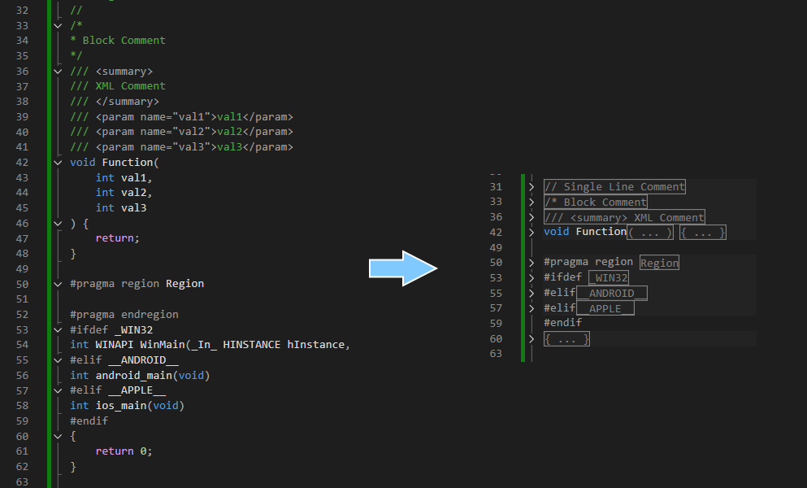

# CppLookOutline  
- [Click here for English](README.md)  

Visual Studio C/C++ のアウトラインをより見やすく拡張します。  
使用するにはデフォルトのアウトライン機能を無効化してください。  
[オプション]>[テキストエディタ]->[C/C++]->[表示]->[アウトライン表示を有効にする]->True  

  

## Pay it forward  

	<strong>MecaProjectはあなたの助けを必要としています。</strong>

  
このプロジェクトへの支援をご検討ください。あなたの支援は、プラットフォームや機能を成長させるために役立ちます。   

このツールが役立つと思われた場合は、私たちの活動を継続できるよう、スポンサーになることをご検討ください。  
以下のスポンサー特典をご用意しております。 
- 非公開ソースコード [CppLookOutline](https://github.com/mmeeccaa/CppLookOutline)
- 新機能への早期アクセス  

 

  

  
